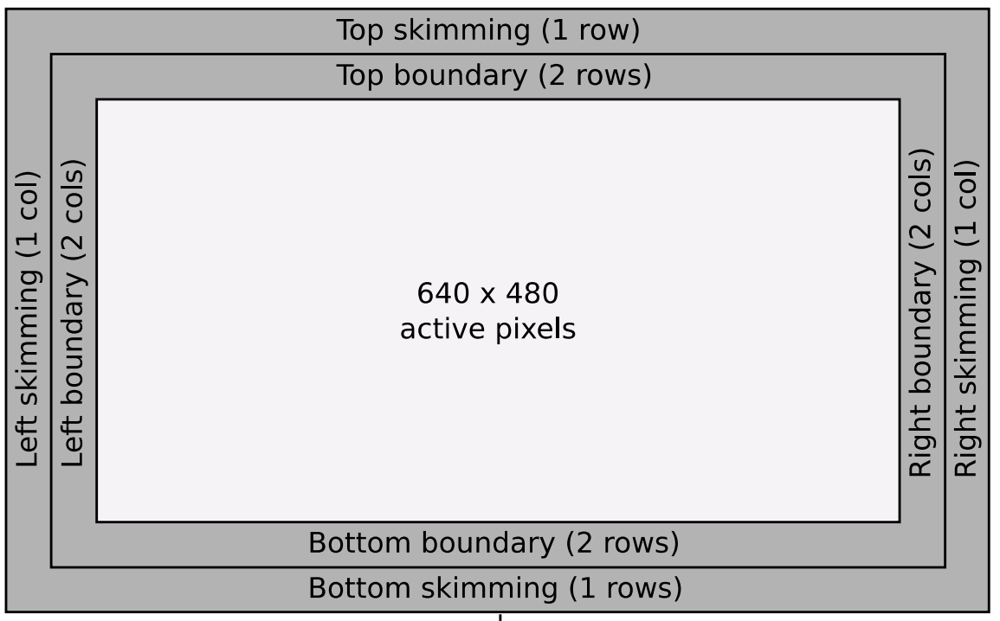
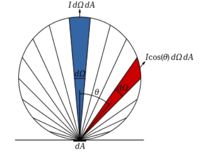
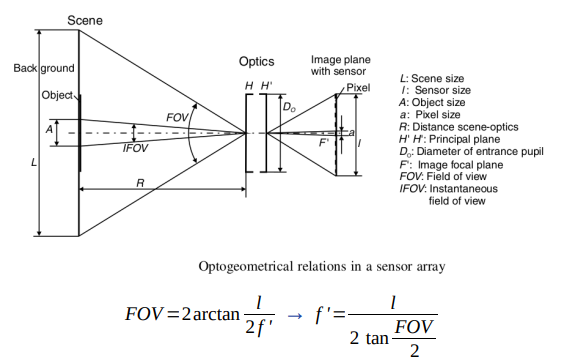
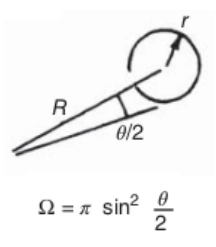
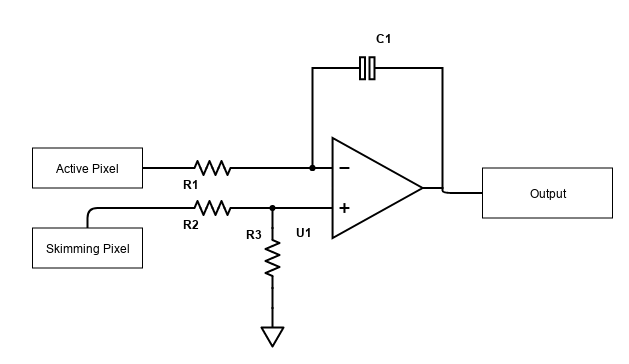

```python
from scipy.constants import k, pi
import numpy as np
```
Importing Boltzman constant, Pi and "Numpy" library

----

```python
# Dimensional parameters of the sensor
pix_h = 640       # Amount of active pixels in horizontal dimension
pix_v = 480       # Amount of active pixels in vertical dimension
boundary_pix = 2  # Amount of rings of boundary pixels around active pixels
skimming_pix = 1  # Amount of rings of skimming pixels around active pixels

# Amount of all pixels in horizontal dimension, including boundary and skiming.
pix_h_all = pix_h + boundary_pix*2 + skimming_pix*2
# Amount of all pixels in vertical dimension, including boundary and skimming.
pix_v_all = pix_v + boundary_pix*2 + skimming_pix*2
```
Here we define sensor area (in pixels) and configuration of it.
Default values corresponds to sensor area defined in ROIC datasheet:



----

Next we define and calculate all necessary dimensions of pixel and whole sensor

```python
pitch = 17e-6         # Pitch between pixels
Fill_factor = 0.65    # Fill factor

l_h = pitch * pix_h_all   # Horizontal size of sensor
l_v = pitch * pix_v_all   # Vertical size of sensor
Ar = l_h * l_v                # Sensor area m2

A_pix = pitch ** 2              # One pixel area 17x17 um2
A_sens = A_pix * Fill_factor    # Sensetive area of one pixel
# Coeficient for sensing area of one pixel regarding to area of whole sensor.
Pix_area_coef = A_sens/Ar
```

----

Physical parameters below,
```python
# Nominal physical parameters of the microbolometer
R_ta_i = 1e6      # Resistance at ambient temperature (nominal)
T_sa = 300        # Ambient temperature
g_ini = 1e-7      # Thermal conductivity (nominal)
c_ini = 5e-9      # Thermal capacity (nominal)
alpha = -0.03     # TCR at ambient temperature

Ea = -(alpha * k * T_sa**2)                      # Activation energy calculated!!! NOT from table!!!
R_0_dark = R_ta_i / (np.exp(Ea / (k * T_sa)))    # R0 constant calculated!!! NOT from table!!!
```
are used in microbolometers equation:


Parameters *R_ta_i*, *g_ini* and *c_ini* are used in "tolerance(.py)" script
to create Non-uniformity pattern.

----

```python
Phi_r = 0    # Angle between the perpendicular to receiver surface
             # and line connecting receiver and radiator centers
Phi_s = 0    # Angle between the perpendicular to radiator surface
             # and line connecting receiver and radiator centers
```
Angles above are used to define souce and receiver position relative to each
other. IR power transmitted/received depends on Lambartian cosine law: 



----

Next are optical parameters of the system:
```python
FOV = np.pi/6      # Field of View
Thetta = FOV/2     # Half of FOV angle
fl = l_h / ( 2 * np.arctan(FOV / 2) )    # Focal length
Omega = pi * ( np.sin( Thetta ) ) ** 2   # Projected solid angle
tau = 1    # Composite transmittance of enviroment
```

Focal length is calculated using given FOV [rad] and sensor maximal (horizontal)
dimension [m]:



Projected solid angle corresponds to round apperture:



----

Bias current through microbolometer:
```python
#BIAS current value and pulse length
int_time = 10e-3  # Integration time
Ib = 50e-6        # BIAS current
```

----

IR radiation wave length range of interest,
used for in-band integration of Planck radiation function:
```python
# Wave length of interest 8-14 um
lambd1 = 8e-6
lambd2 = 14e-6
```

----

Parameters for dead/defective pixel detection:
```python
# DPD
lim = 0.6     # Threshold for DPD stage 1
pix_num = 15  # 1D convolution kernel size.
```

----

Components of ROIC integrator,
```python
# ROIC
# RESISTORS ON OP AMP INPUTS
R1 = 200e6
R2 = 10e3
R3 = 400e6
# GAIN CAPACITOR OF INTEGRATOR
C = 0.2e-12
# EXTERNAL VOLTAGE AS REFERENCE (NOT ACCOMPLISHED!)
V_ref = 1.65 
```
correspond to schematic:



----

Simpliest model of ADC:

```python
# ANALOG TO DIGITAL CONVERTER
max_val = 255;
max_analog = 3.2;
adc_coef = max_val/max_analog
```